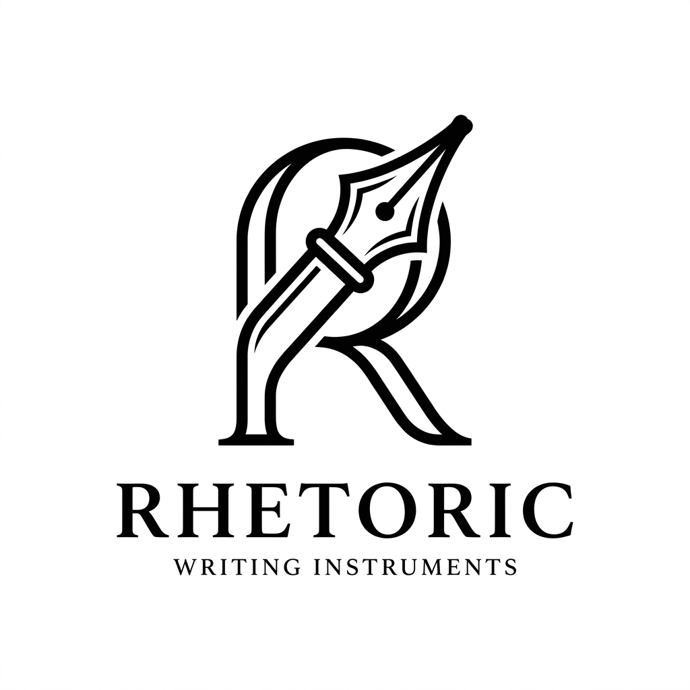
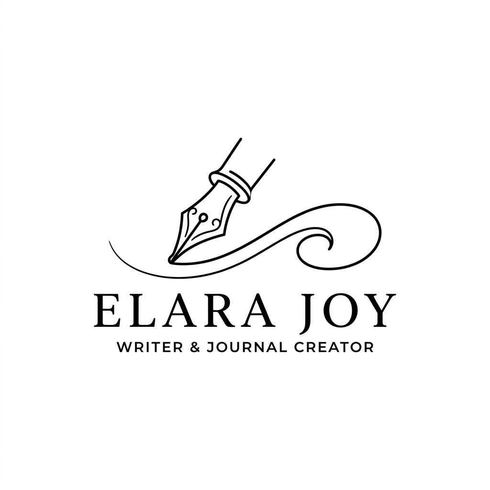
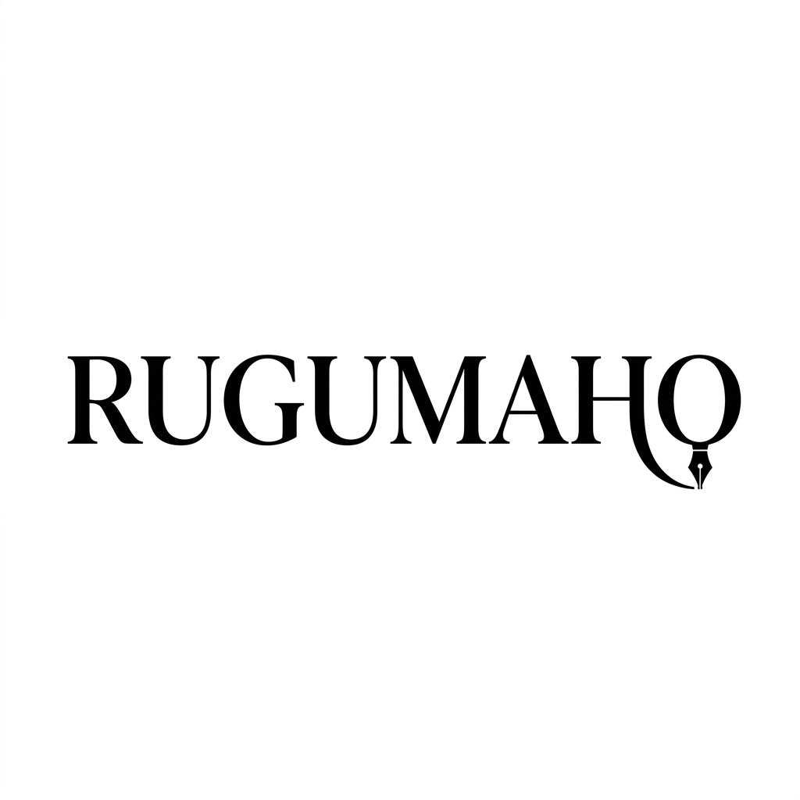

# Brand Logo Proposals - Set 2 (Pen Concepts)

Here are the three premium logo proposals for **RUGUMAHO** incorporating the pen motif, with no African geographic narratives.

---

## Proposal 1: The Monogram Nib
A premium typographic monogram combining a modern fountain pen nib with the letter **R**. Designed with clean vectors for an elegant, minimal corporate look.

---

## Proposal 2: The Line Art Pen
A flowing single-line illustration of a classic fountain pen nib drawing a sleek line. Symbolizes storytelling, active journaling, and sophisticated curation.

---

## Proposal 3: Typographic Wordmark with Pen Detail
A modern serif wordmark styling of the brand name **RUGUMAHO** featuring a subtle fountain pen nib integrated into the typography itself. Clean, sophisticated, and memorable.

