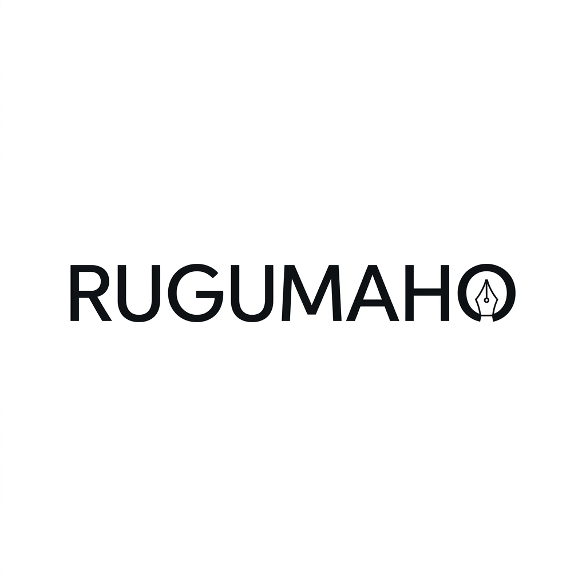
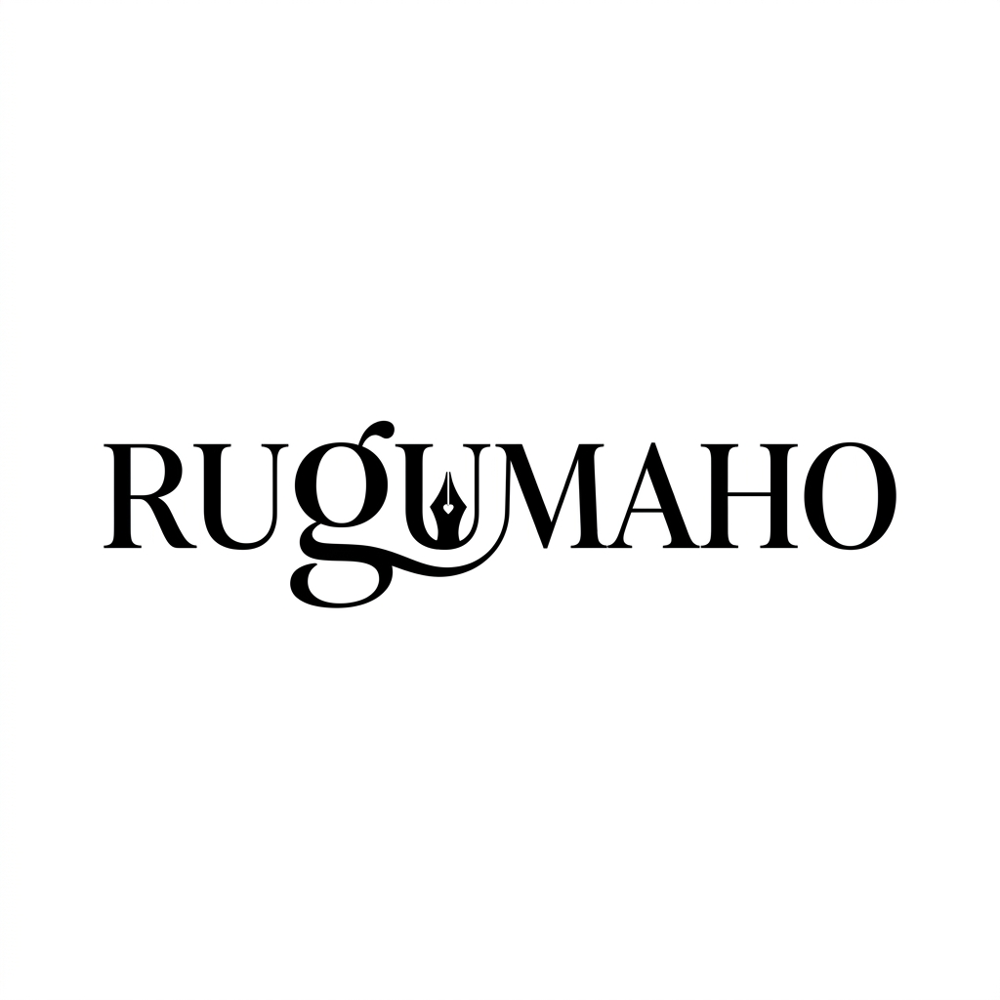

# Brand Logo Proposals - Typographic Wordmarks

Here are the three premium typographic wordmark proposals for **RUGUMAHO** incorporating the pen motif in subtle details.

---

## Proposal 1: Typographic Serif (Previously Proposal 3)
A modern serif wordmark styling of the brand name **RUGUMAHO** featuring a subtle fountain pen nib integrated into the typography itself. Clean, sophisticated, and memorable.

---

## Proposal 2: Modern Geometric Sans (Proposal 3a)
A contemporary geometric sans-serif typeface styling of **RUGUMAHO** with a clean pen nib motif abstractly integrated into the structure of the characters for a modern, clean look.

---

## Proposal 3: Luxury Ligature Serif (Proposal 3b)
A high-fashion, elegant serif typeface wordmark where a delicate pen-stroke ligature connects the letterforms, ending in a subtle pen nib. Extremely refined and editorial.

